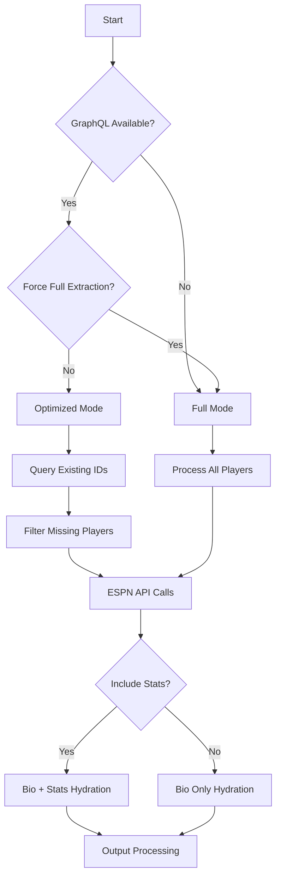

# ESPN API Extractor Data Flow Analysis

## Overview
This document provides a comprehensive data flow analysis of the ESPN API Extractor application, tracing the execution path from the CLI entry point through all API calls, data transformations, and object hydration processes.

## Data Flow Diagram

```
┌─────────────────────────────────────────────────────────────────────────────────────┐
│                             CLI ENTRY POINT                                        │
└─────────────────────────────────┬───────────────────────────────────────────────────┘
                                  │
                                  ▼
                        ┌─────────────────────┐
                        │    __main__.py      │
                        │  Parse Arguments    │
                        └─────────┬───────────┘
                                  │
                                  ▼
                        ┌─────────────────────┐
                        │  Command = ?        │◄
                        └─────┬───────────────┘
                              │
                ┌─────────────┴─────────────┐
                ▼                           ▼
    ┌─────────────────────┐     ┌─────────────────────┐
    │ player-extract      │     │   Other Commands    │
    │                     │     │   (Show Help)       │
    └─────────┬───────────┘     └─────────────────────┘
              │
              ▼
    ┌─────────────────────┐
    │ PlayerExtractRunner │
    │ runners/            │
    └─────────┬───────────┘
              │
              ▼
    ┌─────────────────────┐
    │ PlayerController    │
    │ controllers/        │
    │ execute_extraction()│
    └─────────────────────┘
```

## Conditional Logic Flow

```
GRAPHQL OPTIMIZATION:
┌─────────────────────┐      ┌─────────────────────┐      ┌─────────────────────┐
│ GraphQL Available?  │──NO──│  Full Extraction    │──────│ Process ALL Players │
└─────────┬───────────┘      │  Mode               │      │ (~3000+)            │
          │YES               └─────────────────────┘      └─────────────────────┘
          ▼
┌─────────────────────┐      ┌─────────────────────┐      ┌─────────────────────┐
│ Force Full          │──YES─│  Bypass GraphQL     │──────│ Process ALL Players │
│ Extraction?         │      │                     │      │                     │
└─────────┬───────────┘      └─────────────────────┘      └─────────────────────┘
          │NO
          ▼
┌─────────────────────┐      ┌─────────────────────┐      ┌─────────────────────┐
│ Query Existing      │──────│ Filter Missing      │──────│ Process FILTERED    │
│ Player IDs          │      │ Players Only        │      │ Players (70-90%     │
│                     │      │                     │      │ reduction)          │
└─────────────────────┘      └─────────────────────┘      └─────────────────────┘

STATS INCLUSION:
┌─────────────────────┐      ┌─────────────────────┐
│ Include Stats?      │──NO──│ Bio Only Hydration  │
└─────────┬───────────┘      │ (Skip API Call #4)  │
          │YES               └─────────────────────┘
          ▼
┌─────────────────────┐
│ Full Bio + Stats    │
│ Hydration           │
│ (All 4 API Calls)   │
└─────────────────────┘

SAMPLE SIZE LIMITING:
┌─────────────────────┐      ┌─────────────────────┐
│ Sample Size Set?    │──NO──│ Process All         │
└─────────┬───────────┘      │ Filtered Players    │
          │YES               └─────────────────────┘
          ▼
┌─────────────────────┐
│ Limit to Sample     │
│ Size (Testing)      │
└─────────────────────┘
```

## Data Flow Stages

### Stage 1: Initialization & Configuration
1. **CLI Argument Parsing**: Parse user options (year, threads, batch-size, etc.)
2. **Logger Initialization**: Create Logger instance for tracking
3. **GraphQL Client Setup**: Initialize GraphQL client for optimization
4. **Conditional Routing**: Determine execution path based on flags

### Stage 2: Player Universe Acquisition
1. **GraphQL Optimization Check**: 
   - If enabled: Query existing player IDs from GraphQL endpoint
   - Filter ESPN API calls to only missing players
   - If disabled: Process all players from ESPN

2. **ESPN Fantasy API Call #1**: `get_pro_players()`
   - **Endpoint**: `/players`
   - **View**: `players_wl`  
   - **Filter**: `filterActive: true`
   - **Returns**: List of basic player data (id, name, position, etc.)

### Stage 3: Player Object Creation & Initial Hydration
1. **Player Object Creation**: Convert raw JSON to `Player` objects
2. **Player ID Extraction**: Extract IDs for batch API calls
3. **ESPN Fantasy API Call #2**: `get_player_cards(player_ids)`
   - **Endpoint**: `/players`
   - **View**: `kona_playercard`
   - **Filters**: Player IDs + stat period filters
   - **Returns**: Projections, seasonal stats, outlook, fantasy data

### Stage 4: Kona PlayerCard Hydration
```python
# Data structure created in Player.hydrate_kona_playercard()
player.stats = {
    "projections": {stat_name: value, ...},      # ID: 10{year} (e.g., 102025)
    "preseason": {stat_name: value, ...},        # ID: 01{year} (e.g., 012025)  
    "regular_season": {stat_name: value, ...},   # ID: 02{year} (e.g., 022025)
    "previous_season": {stat_name: value, ...}   # ID: 00{prev_year} (e.g., 002024)
}

# Additional properties set:
player.season_outlook = "Player outlook text..."
player.draft_auction_value = 25.5
player.on_team_id = 123
player.draft_ranks = {...}
player.games_played_by_position = {...}
```

### Stage 5: Multi-threaded Bio & Stats Hydration
1. **EspnCoreRequests Setup**: Initialize with threading configuration
2. **Parallel Processing**: Use ThreadPoolExecutor for concurrent API calls
3. **For Each Player (in parallel)**:
   - **ESPN Core API Call #3**: `hydrate_bio(player)`
     - **Endpoint**: `/athletes/{player_id}`
     - **Sets**: Weight, height, bats, throws, birth info, etc.
   - **ESPN Core API Call #4**: `hydrate_statistics(player)` (if include_stats=True)
     - **Endpoint**: `/athletes/{player_id}/statistics`  
     - **Sets**: `season_stats` with categories and detailed statistics

### Stage 6: Data Transformation & Serialization
1. **PlayerModel Conversion**: `player.to_model()` → Pydantic validation
2. **JSON Serialization**: Convert PlayerModel instances to JSON
3. **File Output**: Write to specified output directory

## Key Data Structures

### Player Object Properties (After Full Hydration)
```python
# Basic ESPN data (from get_pro_players)
player.id: int
player.name: str
player.first_name: str
player.last_name: str
player.primary_position: str
player.eligible_slots: List[str]

# Kona PlayerCard data (from get_player_cards)  
player.stats: Dict[str, Dict[str, Any]]  # 4 keys: projections, preseason, regular_season, previous_season
player.season_outlook: str
player.draft_auction_value: float
player.on_team_id: int
player.draft_ranks: Dict[str, Any]
player.games_played_by_position: Dict[str, int]

# Bio data (from ESPN Core API)
player.weight: float
player.height: int  
player.bats: str
player.throws: str
player.birth_place: Dict
player.date_of_birth: str

# Statistical data (from ESPN Core API statistics endpoint)
player.season_stats: Dict with categories/stats structure
```

### PlayerModel Schema Validation
The PlayerModel expects:
- `stats: Dict[str, Dict[str, Any]]` (string keys required)
- `injured: bool` (boolean required, not None)
- All kona_playercard fields as separate properties

## API Call Patterns

### ESPN Fantasy API
- **Base URL**: `https://fantasy.espn.com/apis/v3/games/{sport}/seasons/{year}`
- **Authentication**: Optional cookies (espn_s2, SWID) for private leagues
- **Rate Limiting**: Built-in retry logic with exponential backoff

### ESPN Core API  
- **Base URL**: `https://site.api.espn.com/apis/site/v2/sports/{sport}`
- **Authentication**: None required
- **Threading**: Parallel requests with configurable worker count

## Error Handling & Recovery

### Failure Points & Mitigation
1. **GraphQL Connection Failure**: Fall back to full extraction
2. **ESPN API Rate Limiting**: Exponential backoff retry
3. **Individual Player Hydration Failure**: Continue processing, track failed players
4. **PlayerModel Validation Failure**: Log error, exclude from output

### Monitoring & Logging
- Progress tracking with batch processing
- Detailed success/failure statistics  
- Thread-safe logging for concurrent operations

## Configuration Options

### Command Line Arguments
- `--year`: Target season (default: 2025)
- `--threads`: Concurrency level (default: 4x CPU cores)
- `--batch-size`: Progress tracking granularity (default: 100)
- `--force-full-extraction`: Bypass GraphQL optimization
- `--graphql-config`: Custom GraphQL endpoint configuration
- `--sample-size`: Limit processing for testing
- `--as-models`: Return Pydantic models vs Player objects

### Conditional Logic Branches


## Performance Characteristics

### Optimization Strategies
1. **GraphQL Pre-filtering**: Reduce ESPN API calls by 70-90%
2. **Multi-threading**: Parallel bio/stats hydration 
3. **Batch Processing**: Progress tracking without performance impact
4. **Connection Pooling**: Reuse HTTP connections
5. **Smart Retry Logic**: Handle rate limits gracefully

### Typical Processing Times
- **GraphQL Query**: ~1-2 seconds
- **get_pro_players**: ~3-5 seconds (3000+ players)
- **get_player_cards**: ~10-15 seconds (batch of 1000+ players)  
- **Parallel Bio Hydration**: ~2-3 minutes (with 16 threads)
- **Stats Hydration**: ~5-8 minutes additional (if enabled)

## Current Issues & Next Steps

### Immediate Fixes Needed
2. **Fix PlayerModel Schema**: Add missing fields, correct validation
3. **Fix Test Data**: Align test expectations with actual data structures
4. **Update Import Paths**: Ensure all refactored imports work

### Test Failure Root Causes
1. **Stats Key Type Mismatch**: Tests use `{0: {...}}` but schema expects `{"projections": {...}}`
2. **Missing projections Field**: Tests expect `model.projections` but it doesn't exist
3. **Boolean Validation**: `injured` field gets None but expects boolean
4. **Empty Stats**: Tests expect populated stats without calling hydration methods
